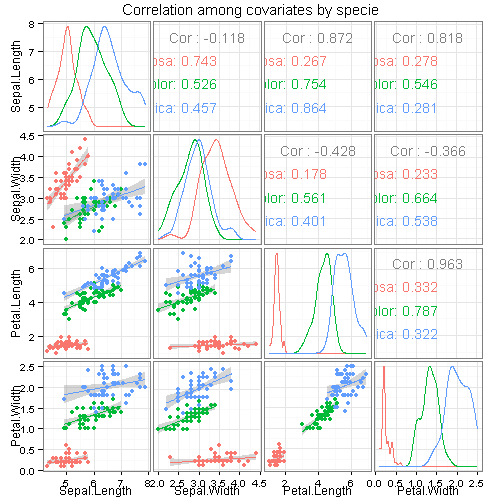

<style>
.title-slide {
    background-color: white;
}
.title-slide hgroup > h1, slide:not(.segue) h2 {
    color: maroon;
}
code {
    font-size: 0.8em;
}
span.setosa {
    color: red;
}
span.versicolor {
    color: green;
}
span.virginica {
    color: blue;
}
div.powered {
    text-align: right;
}
img.powered {
    vertical-align: middle;
    font-style: italic;
}
#finger {
    font-size: 2em;
}
</style>


## 1. Introduction

 <br>
>- Do methods in Machine Learning so really differ a lot among them?<br>
>- Complex methods beat simple methods? <br>
>- Can a simple dataset be enough to show these differences? <br>
>- Is pre-processing critical for the results final quality? <br>
<br>
<br>
>- A <em>Shiny</em> app will allow to quickly test several options to study how they affect a smple machine learning classifcation of a test dataset. <br>
<br>
At the same several performance metrics will be used and shown. Stay tuned!
>- <span id="finger">&#9758;</span>

--- #methods &twocol

## 2. Pre-processing & classification methods

How do data preparation and algorithms improve classificaion?, can we conclude something about using or not using them?

*** =left

Several preprocessing will be alowed:

- Raw values.
- Standarization: $\frac{x - s}{\mu}$, mean 0, SD 1.
- Normalization: $\frac{x - min(x)}{max(x) - min(x)}$, range 0-1.
- PCA transform.

*** =right

A pletora of classifiers will be used:

- Discriminant analysis:
    - LDA (Linear).
    - QDA (Quadratic).
- SVM (Support Vector Machine).
- DT (Decission Tree).
- NB (Naïve Bayes).

--- #eda1 &twocol w1:80% w2:20%

## 3. Exploratory Data analysis (I): Summaries

*** =left


```r
summary(iris[, 1:4])
```

```
  Sepal.Length  Sepal.Width   Petal.Length  Petal.Width 
 Min.   :4.3   Min.   :2.0   Min.   :1.0   Min.   :0.1  
 1st Qu.:5.1   1st Qu.:2.8   1st Qu.:1.6   1st Qu.:0.3  
 Median :5.8   Median :3.0   Median :4.3   Median :1.3  
 Mean   :5.8   Mean   :3.1   Mean   :3.8   Mean   :1.2  
 3rd Qu.:6.4   3rd Qu.:3.3   3rd Qu.:5.1   3rd Qu.:1.8  
 Max.   :7.9   Max.   :4.4   Max.   :6.9   Max.   :2.5  
```

```r
colMeans(iris[, 1:4])
```

```
Sepal.Length  Sepal.Width Petal.Length  Petal.Width 
         5.8          3.1          3.8          1.2 
```

```r
apply(iris[, 1:4], 2, sd)
```

```
Sepal.Length  Sepal.Width Petal.Length  Petal.Width 
        0.83         0.44         1.77         0.76 
```

*** =right

<br>
<strong>Observations:</strong>

- The ranges for values, means and standard deviations (SD) are similar.
- Greatest mean is ~5x the lowest one.
- Greatest SD is 4x the lowest SD.
- No great difference between ranges, so transformations/pre-processing maybe not a great deal.
- Yet big enough so that differences should appear when using or not pre-processing.

--- #eda2 &twocol

## 4. Exploratory Data analysis (II): Correlations

*** =left

 

*** =right

<br>
<strong>Observations:</strong>

- There appear strong correlations between variables, even when splitting by species.
- Some pair of co-variates appear to separate quite well the 3 classes.
- A very good classification should be achieved.
- <span class="setosa">Setosa</span> specie should be the one with the least classification error.
- <span class="versicolor">Versicolor</span> and <span class="virginica">virginica</span> overlap the most in average.

---

## 5. Final notes

<br>
- The app will be developed with ShinyApps from RStudio.
<br>
<br>
- Will use the ShinyDashboard package to create better interfaces.
<br>
<br>
- Documentation in form of a a short guide/manual will be inserted in the same app.
<br>
<br>
- The app will be initially hostd at <a href="http://www.shinyapps.io/">www.shinyapps.io</a>, so there can be availability problems if the app goes too popular, xD.
<br>
<br>

<div class="powered">
Powered by  and .
</div>
